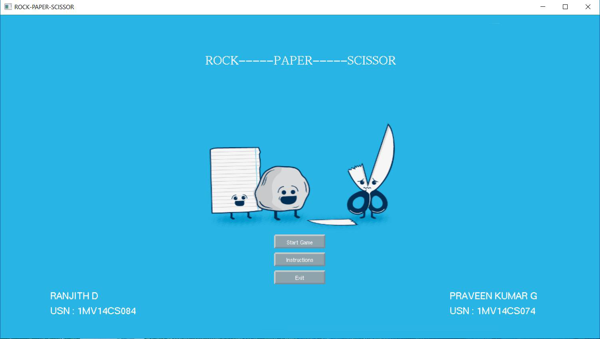
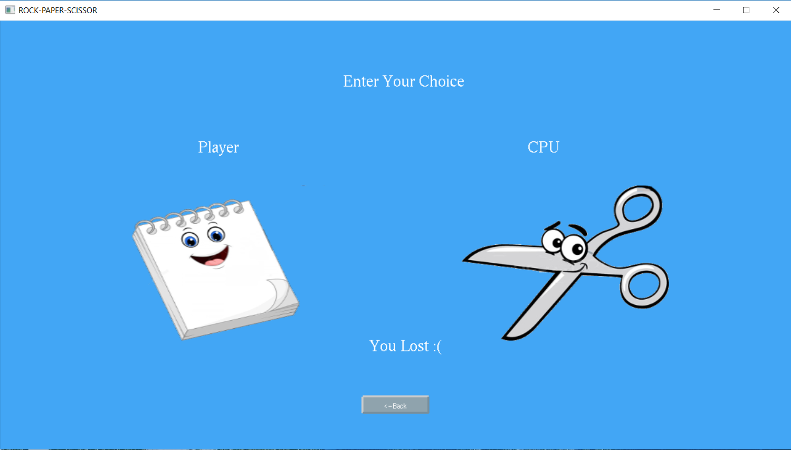
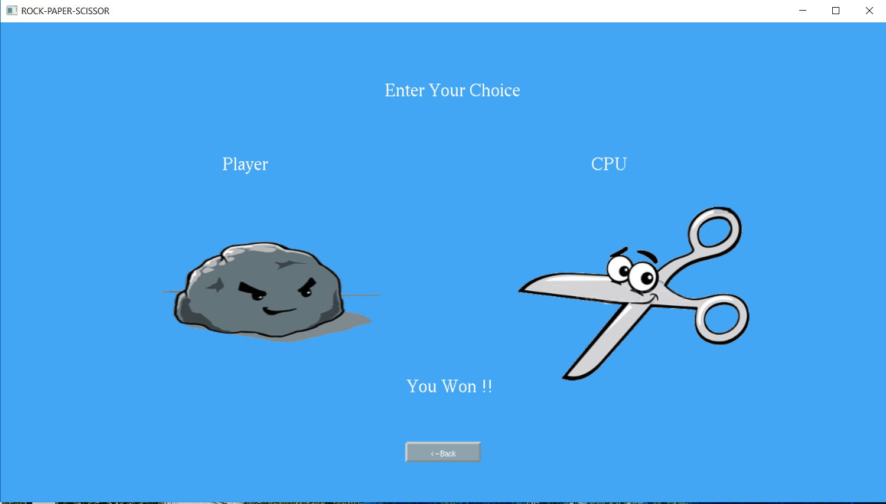
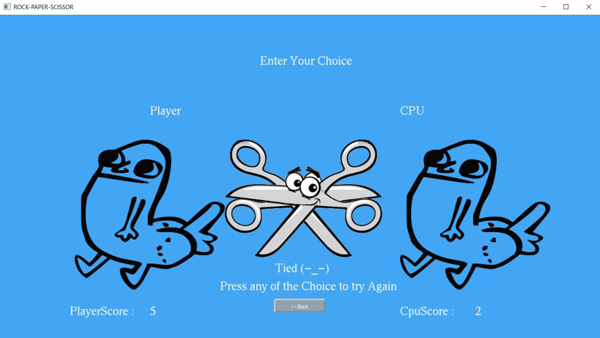

# Rock-Paper-Scissors
A simple graphical game of rock paper scissors made using the openGL library. The game was coded in C++ language.

## Getting started 
To run the application follow the steps:

	1. Clone the repository into your local machine(Windows).
	2. Open the game folder.
	3. Open the game.exe file to start the game. 

## Prerequisites
1. Windows OS.
2. 1GB of free RAM space.
3. 50MB of free disk space. 
4. Preferably OpenGL files installed.(glut files)

## ScreenShots

## Built With

1. `C++` The programmimg language used to manage all aspects of the games.
2. `OpenGl library` The graphics library that provides graphical functions.
3. `lodepng API` API to load images for the game.

## Authors
 1. [Praveen Kumar G](https://github.com/aquiline)
 2. Ranjith D

